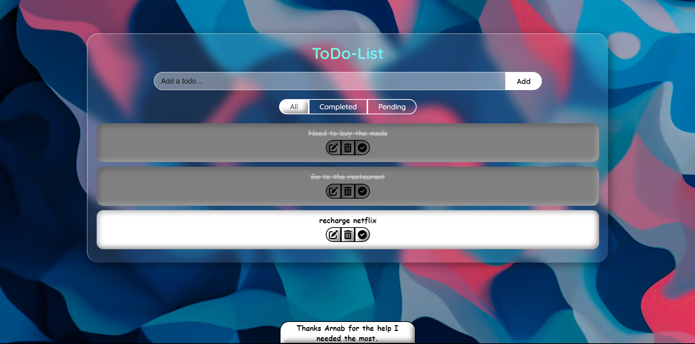

# To-Do List
Made a todo list.

This to-do list is only the front-end and thus cannot keep the data if reloaded.
Please give me suggestions so that I can make the changes and make it much better.

You can take the code if you like. Thank you.

I have also added the feature to give one picture from the four as wallpaper randomly. 

Here goes the image of ui I created.

